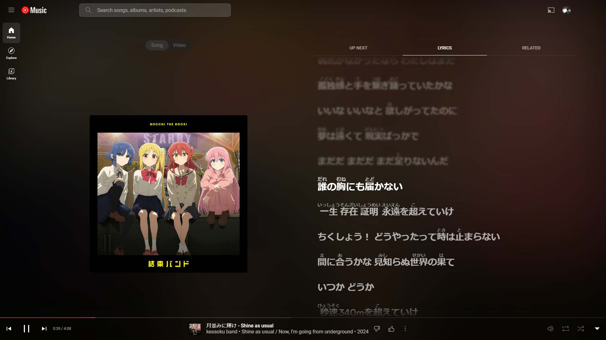

# Furigana on japanese lyrics
This branch is for my personal use and is not meant to be pushed to the original repo, as there doesn't seem to be a request for this feature yet.

However, if you are learning Japanese like I am, it can help you better follow the lyrics.

Please note there might be a slight difference between the generated furigana and actual pronunciations.
